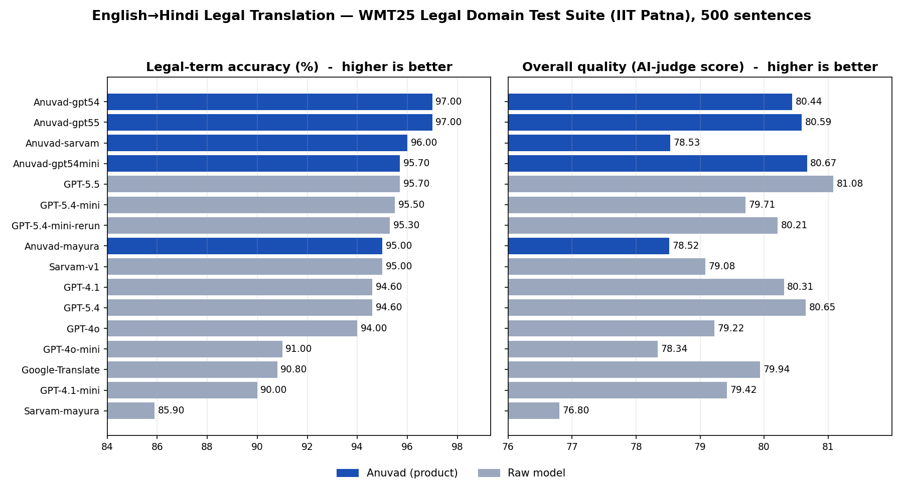

# Legal Machine Translation Benchmark (English → Hindi)

A reproducible, **unbiased** benchmark of English-to-Hindi **legal** machine
translation. It scores raw LLM / NMT models and finished translation **products**
on the same data, with the same code, on the same metrics, and publishes every
per-sentence output so anyone can re-score or audit the numbers.

Maintained by [Vaquill AI](https://www.vaquill.ai). Contributions and
independent re-runs welcome.

> This is a **benchmark**, not a leaderboard ad. We report how each system did on
> each metric, document exactly how scores are computed, and disclose every
> caveat. No latency or price ranking is used to flatter any system.

---

## Why this exists

General MT benchmarks do not reflect **legal** translation, where a wrong term
("acquittal" → "dismissal from service") changes meaning, and where section
numbers, citations and dates must survive verbatim. We benchmark on a
peer-reviewed legal test suite and add a legal-terminology metric on top.

---

## Dataset

**WMT25 Legal Domain Test Suite**, by the **AI & NLP Research Group, IIT Patna**,
published at the Tenth Conference on Machine Translation (WMT 2025).

- Upstream: https://github.com/helloboyn/WMT25-TS
- Paper: Singh, K.B., Kumar, D., & Ekbal, A. (2025). *Evaluation of LLM for
  English to Hindi Legal Domain Machine Translation Systems.* WMT 2025,
  pp. 823–833. https://aclanthology.org/2025.wmt-1.57
- 5,000 parallel EN–HI sentences from court judgments, contracts, legal notices
  and statutory material; word counts 5–54.

We do **not** redistribute the upstream data. `data/fetch_dataset.sh` downloads it
from the source; `data/transform.md` documents exactly how we stratify it.

### Our subset (deterministic)

A stratified **500-sentence** subset, fixed **seed = 42**:
100 short (5–15 words) + 200 medium (16–35) + 200 long (36–54). Same seed → same
sentences for every system.

---

## Systems

**Raw models** (simple prompt, no glossary): GPT-5.4, GPT-5.4-mini, GPT-4o,
GPT-4o-mini, GPT-4.1, GPT-4.1-mini, Sarvam Translate v1, Google Translate.

**Products** (a base engine + a domain layer): **Anuvad** on three bases
(`gpt54`, `gpt54mini`, `sarvam`). Anuvad adds an 83,355-term legal glossary
(Government of India's Vidhi Shabdavali), legal-term / citation / date / currency
preservation, and a review pass. This lets us measure the **lift the product
layer adds on each base model**.

---

## What we measured (in plain English)

For legal translation, the thing that matters most is **accuracy** — does the
translation use the **correct legal words**, and does it **mean the same thing**
as the original? Getting "acquittal" or "bail" wrong can change what a document
means. **Speed and price are deliberately not part of this comparison** — only
how good and how correct the translation is.

We score every system on 7 measures. Here they are in plain words (all on a
0–100 scale; higher is better unless noted):

| What we call it | What it actually checks | Good score |
|---|---|---|
| **Legal-term accuracy** | Did it translate key legal words correctly (e.g. "bail", "acquittal", "trial court")? **The single most important measure for legal work.** | higher % |
| **Overall quality** | An AI judge (trained to agree with human experts) rates how good the translation is. Closest thing to a human grade. | higher |
| **Meaning match** | Does the translation mean the same as the original, even with different words? | higher |
| **Word match** | How closely the exact words match a professional human translation. | higher |
| **Character match** | Letter-by-letter closeness — works especially well for Hindi. | higher |
| **Flexible match** | Like word match, but also gives credit for valid synonyms. | higher |
| **Editing needed** | How much a human would have to fix the output. **Lower is better.** | lower |

*(Technical names, for those who want them: Overall quality = COMET; Meaning
match = BERTScore; Word match = BLEU; Character match = CHRF++; Flexible match =
METEOR; Editing needed = TER. Details in [the scoring section](#how-the-scores-are-computed-and-who-computed-them).)*

---

## How the scores are computed (and who computed them)

This section exists so the numbers are not a black box.

**Who computed them.** We (the maintainers) computed every score with standard,
open-source scoring tools — *not* by hand, and *not* by the model vendors. The
scoring code is in this repo and is applied **identically to every system**
(same code, same reference translations), so no system gets favourable
treatment. Anyone can re-run it on the published per-sentence outputs and get the
same numbers.

**What each system is graded against.** The "right answers" are the **human
reference translations** in the IIT Patna WMT25 test suite — human-made, not
ours. Each system's Hindi output is compared to that human reference.

**How each number is produced** (code: [`scripts/score_full_metrics.py`](scripts/score_full_metrics.py), [`scripts/legal_term_accuracy.py`](scripts/legal_term_accuracy.py)):

| Metric | Tool / model | How the number is made |
|---|---|---|
| BLEU, CHRF++, TER | `sacrebleu` | corpus-level n-gram / character overlap (BLEU, CHRF++) and edit distance to the human reference (TER), over all 500 sentences |
| METEOR | `nltk` | sentence-level METEOR with stem/synonym credit, averaged over 500 |
| BERTScore | `bert_score`, multilingual BERT (`lang=hi`) | semantic similarity (meaning, not exact words); we report F1 |
| COMET | Unbabel `wmt22-comet-da` neural model | reads English source + system output + human reference and predicts a human-correlated quality score; **we rank by this** |
| Legal-term accuracy | our own checker (`legal_term_accuracy.py`) | see below |

**How legal-term accuracy ("the accuracy number") is computed.** We keep a fixed
list of **26 critical legal terms across 6 categories** (court names, party
designations, procedural, criminal, evidence, statute), each mapped to its
accepted standard legal-Hindi rendering(s) — e.g. *bail* → जमानत/ज़मानत,
*acquittal* → दोषमुक्ति, *trial court* → विचारण न्यायालय. For every sentence where
the English term appears in the source, we check whether the system's Hindi
output contains an accepted rendering. Then:

```
legal-term accuracy = correct renderings / applicable term-instances
```

It is an automatic substring check, applied the same way to every system, and is
an **indicative signal of "did it use the right legal term,"** not a human
judgement. The exact term list and accepted variants are in
[`scripts/legal_term_accuracy.py`](scripts/legal_term_accuracy.py) — inspect or
extend them.

**These are automatic metrics.** They correlate with, but do not replace, human
evaluation. We disclose the number of outputs scored (`n`) and API errors
(`err`) so you can see when a system was scored on fewer than 500 sentences.

---

## Results (run of 2026-06-04, 500 sentences)

### The bottom line: accuracy

For a court or a lawyer, the question that matters is simple: **does it get the
legal terms right?** A wrong "bail" or "acquittal" can change what a document
means. On **legal-term accuracy**, the Anuvad product is the most accurate:

| Most accurate on legal terms | Legal-term accuracy |
|---|---|
| Anuvad (on GPT-5.5) | **97.0%** |
| Anuvad (on GPT-5.4) | **97.0%** |
| Anuvad (on Sarvam) | 96.0% |
| GPT-5.5 (plain model) | 95.7% |
| GPT-5.4-mini (plain model) | 95.5% |
| … lowest: Sarvam mayura:v1 | 85.9% |

**On overall quality** (the AI-judge score that best matches human experts), the
new **GPT-5.5** model is the single best all-round system — a real generational
jump. So the honest picture today: **GPT-5.5 gives the best all-round
translation, while Anuvad gives the most reliable legal-term accuracy.** Both are
shown in full below.



Every measure, every system (higher is better, except **Editing needed** where
lower is better). Full machine-readable file:
[`results/benchmark_full_metrics.md`](results/benchmark_full_metrics.md).

| Rank | System | Type | Words | Characters | Flexible | Editing↓ | Meaning | Quality | Legal-term acc. | scored | errors |
|---|---|---|---|---|---|---|---|---|---|---|---|
| 1 | **GPT-5.5** | raw | **32.13** | **58.18** | **51.80** | **54.64** | **88.20** | **81.08** | 95.7 | 500 | 0 |
| 2 | Anuvad-gpt54mini | PRODUCT | 30.59 | 56.88 | 50.78 | 56.34 | 87.75 | 80.67 | 95.7 | 500 | 0 |
| 3 | GPT-5.4 | raw | 29.19 | 55.72 | 49.62 | 58.20 | 87.32 | 80.65 | 94.6 | 500 | 0 |
| 4 | Anuvad-gpt55 | PRODUCT | 30.71 | 56.28 | 50.94 | 56.39 | 87.50 | 80.59 | **97.0** | 500 | 0 |
| 5 | Anuvad-gpt54 | PRODUCT | 30.42 | 56.18 | 50.79 | 56.77 | 87.49 | 80.44 | **97.0** | 500 | 0 |
| 6 | GPT-4.1 | raw | 27.37 | 53.94 | 47.88 | 60.99 | 86.54 | 80.31 | 94.6 | 500 | 0 |
| 7 | GPT-5.4-mini (re-run) | raw | 29.95 | 56.15 | 50.05 | 56.93 | 87.49 | 80.21 | 95.3 | 500 | 0 |
| 8 | Google-Translate | raw | 27.65 | 52.47 | 46.97 | 59.04 | 86.36 | 79.94 | 90.8 | 334 | 166 |
| 9 | GPT-5.4-mini (orig.) | raw | 29.14 | 55.68 | 48.92 | 58.05 | 87.19 | 79.71 | 95.5 | 389 | 111 |
| 10 | GPT-4.1-mini | raw | 24.99 | 51.31 | 45.28 | 62.65 | 85.96 | 79.42 | 90.0 | 500 | 0 |
| 11 | GPT-4o | raw | 28.15 | 53.65 | 47.84 | 60.17 | 86.74 | 79.22 | 94.0 | 500 | 0 |
| 12 | Sarvam-v1 | raw | 29.14 | 53.41 | 47.88 | 58.09 | 86.83 | 79.08 | 95.0 | 500 | 0 |
| 13 | Anuvad-sarvam | PRODUCT | 30.12 | 56.14 | 48.73 | 57.54 | 87.18 | 78.53 | 96.0 | 500 | 0 |
| 14 | Anuvad-mayura | PRODUCT | 29.57 | 55.74 | 48.40 | 57.96 | 87.09 | 78.52 | 95.0 | 500 | 0 |
| 15 | GPT-4o-mini | raw | 24.12 | 50.50 | 44.85 | 64.24 | 85.81 | 78.34 | 91.0 | 500 | 0 |
| 16 | Sarvam-mayura | raw | 23.79 | 48.69 | 43.47 | 64.79 | 85.30 | 76.80 | 85.9 | 499 | 1 |

*GPT-5.5 = `gpt-5.5` at `reasoning_effort=none`. GPT-5.4-mini appears twice: the
original April run (111 API errors) and a clean June re-run (0 errors). "Anuvad-X"
= the Anuvad product on base engine X.*

### What the numbers say (and don't)

- **GPT-5.5 is the new state of the art here.** Raw GPT-5.5 ranks **#1 on six of
  seven metrics** — BLEU, CHRF++, METEOR, TER, BERTScore and COMET — a clear
  generational jump over GPT-5.4 (+2.94 BLEU, +2.46 CHRF++, +0.43 COMET).
- **On a top-tier base, the product layer no longer lifts quality metrics.**
  Anuvad on GPT-5.5 (COMET 80.59, BLEU 30.71) scores *below* raw GPT-5.5 (COMET
  81.08, BLEU 32.13). The glossary enforces standard terms that can diverge from
  the reference's exact wording, which helps terminology but slightly lowers
  overlap/semantic scores once the base model is already excellent. (On weaker
  bases the layer *did* lift most metrics — compare Anuvad-sarvam vs raw
  Sarvam-v1.) **The layer's one remaining, real win is terminology consistency:**
  Anuvad on GPT-5.5 and GPT-5.4 tie for the **highest legal-term accuracy (97.0%)**,
  above raw GPT-5.5 (95.7%).
- **The April API-error problem is gone.** The GPT-5.4-mini re-run completed all
  500 with **0 errors** and scored higher (COMET 80.21 vs 79.71) than April's
  111-error run — the errors had been depressing its numbers.
- **mayura:v1 is the weakest option** for legal Hindi (raw COMET 76.8, term
  85.9%), well below `sarvam-translate:v1` — confirming `sarvam-translate:v1`
  (which Anuvad uses) is the right Sarvam model.

No single system wins every metric; we report all seven so readers can weight
them for their own use case.

## Reproduce

```bash
# 1. Raw-model benchmark (anyone can run this with their own API keys)
pip install -r requirements.txt
bash data/fetch_dataset.sh
python scripts/benchmark_translation.py            # writes results/benchmark_<model>.json

# 2. Full metric scoring on the saved outputs (no API calls)
python scripts/score_full_metrics.py               # writes results/benchmark_full_metrics.{json,md}
```

The **Anuvad product** rows are produced by `scripts/benchmark_anuvad.py`, which
calls Vaquill's proprietary translation pipeline (glossary + post-processing) and
therefore needs Vaquill's backend and glossary database. **You cannot reproduce
the Anuvad pipeline from this repo** — but we publish **every Anuvad per-sentence
output** in `results/`, so anyone can independently re-score and audit the Anuvad
numbers with `score_full_metrics.py`. That is the honest line: the raw-model
benchmark is fully open; the product's *outputs* are open and auditable; the
product's *pipeline* is proprietary.

---

## Repo layout

```
scripts/
  benchmark_translation.py   raw-model runner (open, reproducible by anyone)
  benchmark_anuvad.py        Anuvad product runner (needs Vaquill backend; here for transparency)
  legal_term_accuracy.py     the 26-term legal-terminology checker
  score_full_metrics.py      scores ALL systems on the full metric set from saved outputs
data/
  fetch_dataset.sh           downloads the WMT25-TS dataset from upstream
  transform.md               exact stratification / cleaning steps
results/
  benchmark_<system>.json    per-sentence outputs (en, human ref, system output) for every system
  benchmark_full_metrics.{json,md}   the combined, ranked table
```

---

## Caveats (please read before citing)

- **BLEU vs glossary.** BLEU rewards matching the reference's exact wording; a
  glossary that enforces a different-but-correct standard term can leave BLEU
  flat while improving terminology. We report COMET and term accuracy precisely
  so quality is not judged on overlap alone.
- **Term-accuracy ceiling.** The 26 terms are common; strong models already score
  ~90–95%. The glossary's larger value is the long tail of specialised terms,
  which this metric under-counts.
- **API errors.** Some raw runs had transient API failures (disclosed per system
  in the `errors` / `n` columns); those systems are scored on their successful
  outputs.
- **Subset, not full set.** 500 of 5,000 sentences. A different seed shifts
  absolute scores ~1–2 BLEU but not the relative picture.
- **Automatic metrics, not human evaluation.** These correlate with, but do not
  replace, human judgment.

---

## License

Code: Apache-2.0 (see `LICENSE`). The dataset is the property of its authors
(IIT Patna) under their upstream terms; we redistribute none of it. Result files
contain our systems' outputs plus the dataset's reference sentences for scoring
transparency; if the upstream authors object to reference redistribution we will
replace references with hashes.
